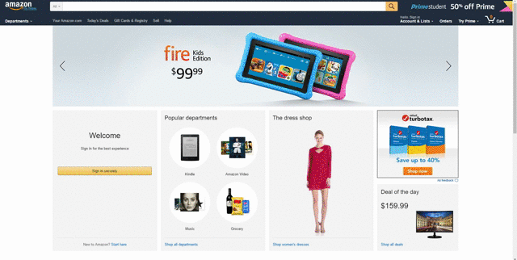

    
    

Alizon: Cut out the Middleman
===========================
Alizon lets you know if an Amazon item is not actually an Amazon item at all. Don't be fooled by the vague descriptions, unreliable pictures, and fake reviews; you are likely seeing a generic product from the Chinese website AliExpress.com that has been extravagently marked up for American consumers. Laptop chargers selling for $0.82 on AliExpress are advertised on Amazon for $14.95. Amazon resellers sell clothes hangers for $12.99/dozen, but you can find the identical item on AliExpress for $11.32/100. Trendy clothing is given a fancy description and a 300% premium for uninformed Westerners. Alizon protects you from predatory price gouging by letting you know if the Amazon item you're vieiwng can be purchased directly from the seller at AliExpress. Save money, save time, and cut out the middleman.

Finding a Match
----------------------
Alizon extracts an Amazon product's ASIN (Amazon Standard Identification Number) and uses the Amazon API to find more information about the product such as the title, price, and image. It then proceeds to conduct an exhaustive search of the item on AliExpress to find products with equivalent titles. Alizon uses the Python Imaging Library to intelligently find matches between the product images from Amazon and AliExpress, with images over a 95% match being considered the most seriously. An algorithm computes a confidence value of a match based on these results and returns the duplicate AliExpress item.

Deploying the Software
------------------------------
Almost everything in the Alizon works on Python 2.7. We've been using Python Flask module to provide a stable server for the requests. Our server is located on <a href='pythonanywhere.com'>https://pythonanywhere.com</a>. Server takes in a link from a user (using JavaScript <a href='https://chrome.google.com/webstore/category/extensions'>Google Chrome Extension</a>), then it processes the information given by <a href='https://pypi.python.org/pypi/python-amazon-product-api/'>Amazon's api</a> and goes through a thorough comparison with lots of products on Aliexpress. In order to find the best match among products, we have been using <a href='https://pypi.python.org/pypi/aliexpress-api-client/0.1.0'>Aliexpress Api</a>, <a href='http://www.pythonware.com/products/pil/'>PIL Library</a> and some amount of computational libraries. On the client side, beyond JavaScript, we've been using <a href='http://api.jquery.com/jquery.ajax/'>jQuery with Ajax</a>.

    

